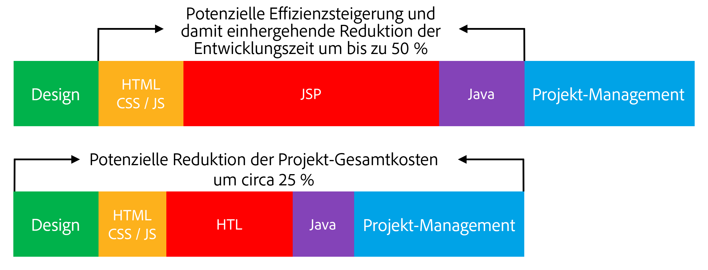

# Überblick {#overview}

HTML Template Language (HTL), unterstützt von Adobe Experience Manager (AEM), soll ein hoch produktives Webframework auf Unternehmensebene bereitstellen, das die Sicherheit erhöht. Es ermöglicht auch HTML-Entwicklern ohne Java-Kenntnisse, besser an AEM Projekten teilzunehmen.

[Als Einführung in AEM 6.0](history.md) ist die HTML-Vorlagensprache das bevorzugte und empfohlene serverseitige Vorlagensystem für das HTML in AEM. Die HTML-Vorlagensprache unterstützt Web-Entwickler, die zuverlässige Unternehmens-Websites erstellen müssen, dabei, die Sicherheit und die Entwicklungseffizienz zu erhöhen.

## Erhöhte Sicherheit {#increased-security}

HTML Template Language (HTL) verbessert die Site-Sicherheit, indem auf alle Ausgabevariablen automatisch eine kontextsensitive Maskierung angewendet wird, wodurch diese sicherer ist als die meisten anderen Vorlagensysteme. HTL ermöglicht diesen Ansatz, da sie die HTML-Syntax versteht und diese Kenntnisse verwendet, um die erforderliche Maskierung für Ausdrücke basierend auf ihrer Position im Markup anzupassen. Diese Methode kann dazu führen, dass in den Attributen `href` oder `src` platzierte Ausdrücke anders maskiert werden als Ausdrücke, die in anderen Attributen oder an anderer Stelle platziert werden.

Das gleiche Ergebnis kann mit Vorlagensprachen wie JSP erreicht werden, aber in diesem Fall muss die Entwicklerin oder der Entwickler manuell sicherstellen, dass jede Variable mit der richtigen Maskierung versehen ist. Da eine einzelne Unterlassung oder ein Fehler in der angewendeten Maskierung potenziell ausreicht, um eine Sicherheitslücke beim Cross-Site-Scripting (XSS) zu verursachen, entschied sich Adobe, diese Aufgabe mit HTL zu automatisieren. Bei Bedarf können Entwicklerinnen und Entwickler immer noch ein anderes Maskieren für Ausdrücke definieren, aber mit HTL entspricht das Standardverhalten viel eher dem gewünschten Verhalten, was die Wahrscheinlichkeit von Fehlern verringert.

## Vereinfachte Entwicklung {#simplified-development}

Die HTML-Vorlagensprache ist einfach zu erlernen und ihre Funktionen sind absichtlich begrenzt, um sicherzustellen, dass sie einfach und unkompliziert bleibt. Sie verfügt über leistungsstarke Mechanismen für das Strukturieren von Markup und das Aufrufen der Logik. Zugleich erzwingt sie immer die strenge Trennung von Belangen zwischen Markup und Logik. HTL ist eine standardmäßige HTML5, die Ausdrücke und Datenattribute verwendet, um das Markup mit dynamischem Verhalten zu kommentieren. Dieser Ansatz behält die Gültigkeit und Lesbarkeit des Markups bei. Die Auswertung der Ausdrücke und Datenattribute erfolgt vollständig Server-seitig und ist auf Client-Seite nicht sichtbar, wo jedes gewünschte JavaScript-Framework ohne Störung verwendet werden kann.

Diese Funktionen ermöglichen es HTML-Entwicklern ohne Java-Kenntnisse, HTL-Vorlagen zu bearbeiten, sich in das Entwicklungsteam zu integrieren und die Zusammenarbeit mit Java-Entwicklern zu optimieren, die den ganzen Stapel gemeinsam nutzen. Umgekehrt können sich Java-Entwickler auf den Backend-Code konzentrieren, ohne sich um HTML zu sorgen.

## Reduzierte Kosten {#reduced-costs}

Erhöhte Sicherheit, vereinfachte Entwicklung und verbesserte Teamzusammenarbeit, bedeutet für AEM Projekte weniger Aufwand, schnellere Markteinführungszeiten (TTM) und niedrigere Gesamtbetriebskosten (TCO).

Die erneute Implementierung der Adobe.com Site mit HTML Template Language hat gezeigt, dass Projektkosten und -dauer auf ca. 25 % reduziert werden.

Das obige Diagramm zeigt die folgenden, potenziell durch HTL ermöglichten Effizienzverbesserungen:

* **HTML / CSS / JS:** HTML-Entwickler können HTL-Vorlagen direkt bearbeiten, sodass Frontend-Designs direkt auf AEM Komponenten implementiert werden können, sodass keine separate Implementierung erforderlich ist. Dieser Ansatz reduziert schmerzhafte Iterationen mit den Java-Entwicklern im Vollstapel.
* **JSP/HTL:** Da HTL selbst kein Java-Wissen erfordert und zum Schreiben unkompliziert ist, ist jeder Entwickler mit HTML-Expertise berechtigt, die Vorlagen zu bearbeiten.
* **Java:** Dank der klaren und einfach zu verwendenden Use-API von HTL wird die Schnittstelle zur Geschäftslogik klarer, was auch der Java-Entwicklung insgesamt zugutekommt.

## Einführungsvideo {#video}

Das folgende Video aus einer [AEM Gems-Sitzung](https://experienceleague.adobe.com/en/docs/events/experience-manager-gems-recordings/gems2014/aem-introduction-to-htl) bietet einen Überblick über den Zweck von HTL sowie Implementierungsbeispiele.

>[!VIDEO](https://video.tv.adobe.com/v/19504/?quality=9)

Beachten Sie, dass das Video durch [seinen früheren Namen Sightly](history.md) auf HTL verweist.

## Nächste Schritte {#next-steps}

Nachdem Sie die Ziele und Vorteile von HTL kennen, können Sie mit der Sprache beginnen. Siehe [Erste Schritte mit der HTML-Vorlagensprache](getting-started.md).
