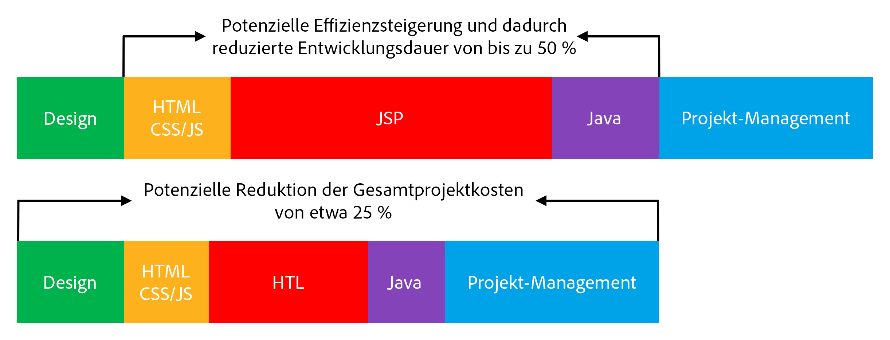

# Überblick {#overview}

>[!TIP]
>
>**Haben Sie schon Edge Delivery Services für AEM in Betracht gezogen?**
>
>Sie können die in diesem Dokument beschriebenen Methoden für bestehende Projekte weiter verwenden. Für neue Projekte empfiehlt Adobe jedoch die Verwendung von [Edge Delivery Services](https://experienceleague.adobe.com/de/docs/experience-manager-cloud-service/content/edge-delivery/overview).

HTML Template Language (HTL), unterstützt von Adobe Experience Manager (AEM), hat das Ziel, ein hochproduktives Webframework auf Unternehmensebene bereitzustellen, das die Sicherheit erhöht. Es ermöglicht auch HTML-Entwickelnden ohne Java-Kenntnisse, besser an AEM-Projekten teilhaben zu können.

Die [in AEM 6.0 eingeführte](history.md) HTML Template Language ist das bevorzugte und empfohlene Server-seitige Vorlagensystem für HTML in AEM. Die HTML-Vorlagensprache unterstützt Web-Entwickler, die zuverlässige Unternehmens-Websites erstellen müssen, dabei, die Sicherheit und die Entwicklungseffizienz zu erhöhen.

## Erhöhte Sicherheit {#increased-security}

Die HTML Template Language (HTL) verbessert die Site-Sicherheit, indem auf alle Ausgabevariablen automatisch eine kontextsensitive Maskierung angewendet wird, wodurch diese sicherer ist als die meisten anderen Vorlagensysteme. HTL ermöglicht diesen Ansatz, da sie die HTML-Syntax versteht, und verwendet dieses Wissen zum Anpassen der erforderlichen Maskierung für Ausdrücke auf der Grundlage ihrer Position im Markup. Diese Methode kann dazu führen, dass in `href`- oder `src`-Attributen platzierte Ausdrücke anders maskiert werden als Ausdrücke, die in anderen Attributen oder an anderer Stelle platziert werden.

Das gleiche Ergebnis kann mit Vorlagensprachen wie JSP erreicht werden, aber in diesem Fall muss die Entwicklerin bzw. der Entwickler manuell sicherstellen, dass jede Variable mit der richtigen Maskierung versehen ist. Da ein einziges Weglassen oder ein Fehler hinsichtlich der angewendeten Maskierung potenziell ausreichen kann, um eine Sicherheitslücke beim Cross-Site-Scripting (XSS) zu verursachen, hat Adobe entschieden, diese Aufgabe mit HTL zu automatisieren. Bei Bedarf können Entwicklerinnen und Entwickler immer noch ein anderes Maskieren für Ausdrücke definieren, aber mit HTL entspricht das Standardverhalten viel eher dem gewünschten Verhalten, was die Wahrscheinlichkeit von Fehlern verringert.

## Vereinfachte Entwicklung {#simplified-development}

Die HTML-Vorlagensprache ist einfach zu erlernen und ihre Funktionen sind absichtlich begrenzt, um sicherzustellen, dass sie einfach und unkompliziert bleibt. Sie verfügt über leistungsstarke Mechanismen für das Strukturieren von Markup und das Aufrufen der Logik. Zugleich erzwingt sie immer die strenge Trennung von Belangen zwischen Markup und Logik. Bei der HTL an sich handelt es sich um den Standard HTML5, da sie Ausdrücke und Datenattribute verwendet, um das Markup auf dynamische Weise mit Anmerkungen zu versehen. Dieser Ansatz wahrt die Gültigkeit und Lesbarkeit des Markups. Die Auswertung der Ausdrücke und Datenattribute erfolgt vollständig Server-seitig und ist auf der Client-Seite nicht sichtbar, wo jedes gewünschte JavaScript-Framework ohne Störung verwendet werden kann. 

Durch diese Funktionen können HTML-Entwickelnde ohne Java-Kenntnisse HTL-Vorlagen bearbeiten, Teil des Entwicklungs-Teams sein und die Zusammenarbeit mit den Java-Entwicklungsexpertinnen und -experten optimieren. Umgekehrt können sich Java-Entwickelnde wiederum auf den Backend-Code konzentrieren und müssen sich nicht um HTML kümmern.

## Reduzierte Kosten {#reduced-costs}

Erhöhte Sicherheit, vereinfachte Entwicklung und verbesserte Team-Zusammenarbeit, in der Folge weniger Aufwand bei AEM-Projekten, schnellere Markteinführungszeiten (TTM) und niedrigere Gesamtbetriebskosten (TCO).

Die erneute Implementierung der Site Adobe.com mit HTML Template Language hat gezeigt, dass Projektkosten und -dauer auf ca. 25 % reduziert werden.

Das obige Diagramm zeigt die folgenden, potenziell durch HTL ermöglichten Verbesserungen hinsichtlich der Effizienz:

* **HTML/CSS/JS:** HTML-Entwickelnde können die HTL-Vorlagen direkt bearbeiten, wodurch die Frontend-Designs direkt in die AEM-Komponenten implementiert werden können und keine getrennte Implementierung mehr erforderlich ist. Dieser Ansatz reduziert mühevolle wiederholte Durchgänge mit den Java-Entwicklungsexpertinnen und -experten.
* **JSP/HTL:** Da HTL selbst keine Java-Kenntnisse erfordert und einfach zu schreiben ist, ist jede Entwicklerin und jeder Entwickler mit HTML-Kenntnissen in der Lage, die Vorlagen zu bearbeiten.
* **Java:** Dank der klaren und einfach zu verwendenden Use-API von HTL wird die Schnittstelle zur Geschäftslogik klarer, was auch der Java-Entwicklung insgesamt zugutekommt.

## Einführungsvideo {#video}

Das folgende Video aus einer [AEM Gems-Sitzung](https://experienceleague.adobe.com/de/docs/events/experience-manager-gems-recordings/gems2014/aem-introduction-to-htl) gibt einen Überblick über den Zweck von HTL sowie Implementierungsbeispiele.

>[!VIDEO](https://video.tv.adobe.com/v/19504/?quality=9)

Bitte beachten Sie, dass sich das Video auf HTL unter [seinem früheren Namen, Sightly](history.md), bezieht.

## Nächste Schritte {#next-steps}

Nachdem Sie nun die Ziele und Vorteile von HTL kennen, können Sie sich mit der Sprache vertraut machen. Siehe [Erste Schritte mit der HTML Template Language](getting-started.md).
